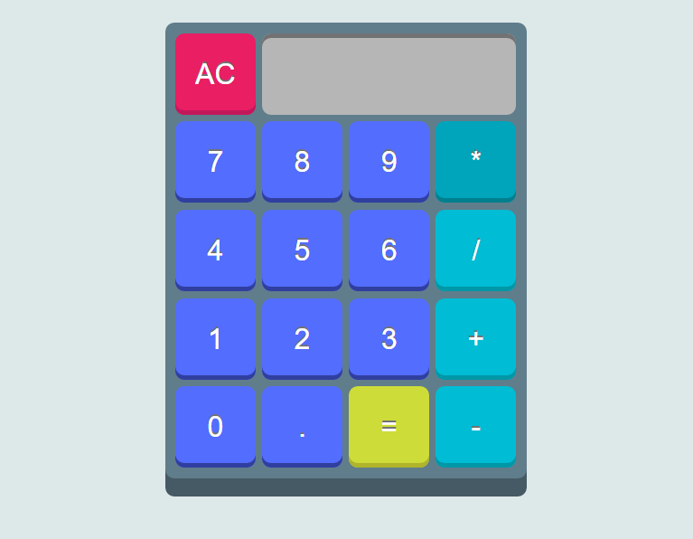

#jsCalculator
Calculator for FreeCodeCamp zipline: https://www.freecodecamp.com/challenges/build-a-javascript-calculator

#Preview as of 17-jun-16

Extensions used:
* [Mathjs](http://mathjs.org/)
* [domReady](https://github.com/ded/domready)
* [bonzo](https://github.com/ded/bonzo)
* [qwery](https://github.com/ded/qwery)
* [bean](https://github.com/fat/bean)